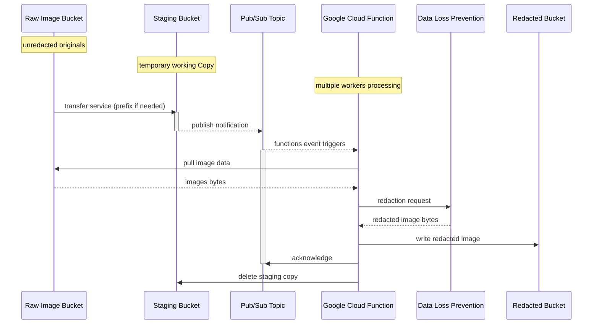

```mermaid
sequenceDiagram
    participant src as Raw Image Bucket
        Note over src: unredacted originals
    participant stage as Staging Bucket
        Note over stage: temporary working Copy
    participant topic as Pub/Sub Topic
    participant gcf as Google Cloud Function
        Note over gcf: multiple workers processing
    participant dlp as Data Loss Prevention
    participant db as Redacted Bucket

    src ->> stage: transfer service (prefix if needed)
    activate stage
    stage -->> topic: publish notification
    deactivate stage
    
    %% Is event a pull that needs ack?
    topic -->> gcf: functions event triggers
    
    %%gcf ->> topic: pull event
    activate topic
    %%topic -->> gcf: image GCS Details
    gcf ->> src: pull image data
    src -->> gcf: images bytes
    gcf ->> dlp: redaction request
    dlp -->> gcf: redacted image bytes
    gcf ->> db: write redacted image
    gcf ->> topic: acknowledge
    deactivate topic

    gcf ->> stage: delete staging copy
```
